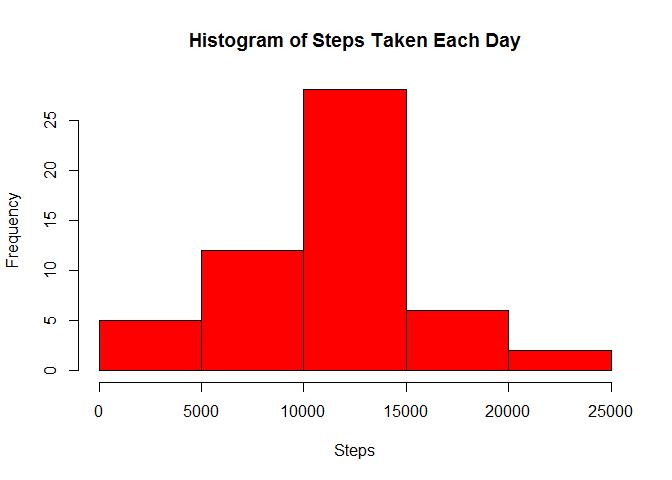
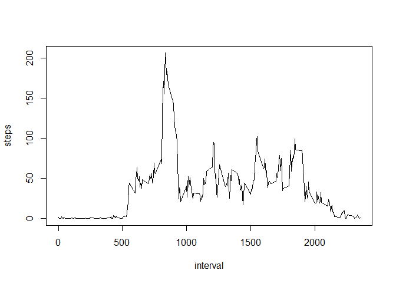
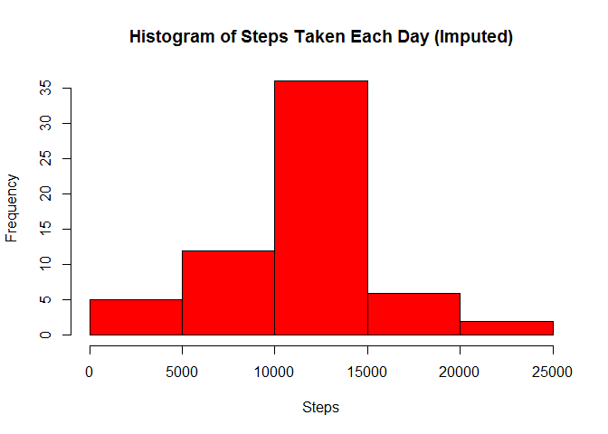
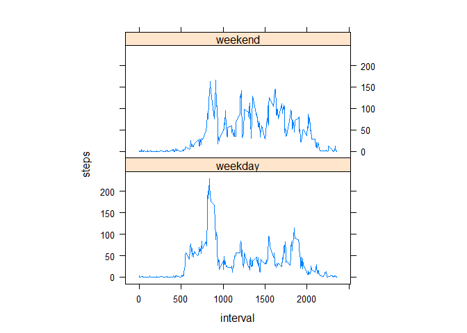

# Reproducible Research: Peer Assessment 1


####Loading and preprocessing the data.

1. Load the data.

```r
act = read.csv("activity.csv")
```

2. Process/transform the data (if necessary) into a format suitable for your analysis.

```r
stepsdate<-aggregate(steps~date,data=act,sum,na.rm = TRUE)
```


####What is mean total number of steps taken per day?

1. Make a histogram of the total number of steps taken each day.

```r
hist(stepsdate$steps,xlab="Steps",main="Histogram of Steps Taken Each Day",col = "red")
```

 

2. Calculate and report the mean and median total number of steps taken per day.

```r
mean(stepsdate$steps)
```

```
## [1] 10766.19
```

```r
median(stepsdate$steps)
```

```
## [1] 10765
```
The **mean** total number of steps taken per day is 10766.19.
The **median** total number of steps taken per day is 10765.

####What is the average daily activity pattern?

1. Make a time series plot (i.e. type = "l") of the 5-minute interval (x-axis) and the average number of steps taken, averaged across all days (y-axis).

```r
stepsinterval<-aggregate(steps~interval, data = act, mean, na.rm = TRUE)
plot(steps~interval, data= stepsinterval, type = "l")
```

 

2. Which 5-minute interval, on average across all the days in the dataset, contains the maximum number of steps?

```r
stepsinterval[which.max(stepsinterval$steps), ]$interval
```

```
## [1] 835
```
It is the 835th interval.

####Imputing missing values.

1. Calculate and report the total number of missing values in the dataset (i.e. the total number of rows with NAs).

```r
sum(is.na(act$steps))
```

```
## [1] 2304
```
The total number of rows with **NA** are 2304. 

2. Devise a strategy for filling in all of the missing values in the dataset. The strategy does not need to be sophisticated. For example, you could use the mean/median for that day, or the mean for that 5-minute interval, etc.

####My strategy
For imputation, we replace the NA by the mean step value for that 5-minute interval. We already have this data when we created the **stepsinterval** dataset.

We loop across the rows of the data **act**. If steps' value is NA in that row, we will look up the steps value from the dataset **stepsinterval** for this value of interval and replace the NA value with the
mean value.


3. Create a new dataset that is equal to the original dataset but with the missing data filled in.


```r
# perform the imputation
for (i in 1:nrow(act)){
  if (is.na(act$steps[i])){
    row_id <- which(stepsinterval$interval == act$interval[i])
    act$steps[i] <- stepsinterval$steps[row_id]
  }
}
```

4. Make a histogram of the total number of steps taken each day and Calculate and report the mean and median total number of steps taken per day. Do these values differ from the estimates from the first part of the assignment? What is the impact of imputing missing data on the estimates of the total daily number of steps?

```r
stepsdate_imputed <- aggregate(steps~date, data = act, sum)
hist(stepsdate_imputed$steps,xlab="Steps",main="Histogram of Steps Taken Each Day (Imputed)",col = "red")
```

 

```r
mean(stepsdate_imputed$steps)
```

```
## [1] 10766.19
```

```r
median(stepsdate_imputed$steps)
```

```
## [1] 10766.19
```

The **mean** total number of steps taken per day is 10766.19.
The **median** total number of steps taken per day is 10766.19.
After imputation, the means remain the same because we put the mean value to those corresponding 5-min interval with missing value. 
There is a slight change in the median value.
The impact of imputing missing data is that the number of data in the middle of histogram has increased because the new data with mean steps value has been added.

####Are there differences in activity patterns between weekdays and weekends?

1. Create a new factor variable in the dataset with two levels - "weekday" and "weekend" indicating whether a given date is a weekday or weekend day.

```r
# convert date from string to Date class and add a new column
act$day<- weekdays(as.Date(act$date, "%Y-%m-%d"))

# add a new column called day type and initialize to weekday
act$day_type <- c("weekday")

# If day is Saturday or Sunday, make day_type as weekend
for (i in 1:nrow(act)){
  if (act$day[i] == "Saturday" || act$day[i] == "Sunday"){
    act$day_type[i] <- "weekend"
  }
}

# convert day_type from character to factor
act$day_type <- as.factor(act$day_type)
```

2. Make a panel plot containing a time series plot (i.e. type = "l") of the 5-minute interval (x-axis) and the average number of steps taken, averaged across all weekday days or weekend days (y-axis). See the README file in the GitHub repository to see an example of what this plot should look like using simulated data.

```r
stepsinterval_daytype<-aggregate(steps ~ interval+day_type,act,mean)
library(lattice)
xyplot(steps ~ interval | factor(day_type),data=stepsinterval_daytype,aspect = 1/2,type = "l")
```

 


